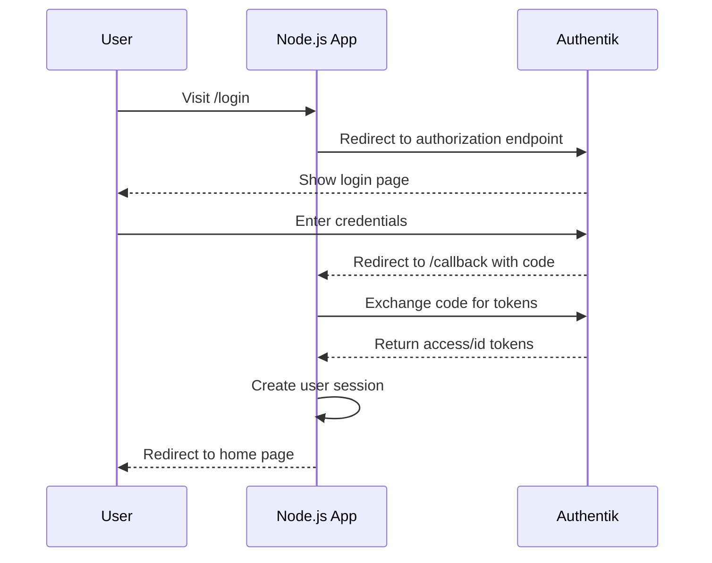

# Node.js SSO Sample with Authentik

This project demonstrates Single Sign-On (SSO) using Node.js and Authentik with OpenID Connect (OIDC).

## Architecture Diagram



## Features

- Express.js web server
- Passport.js for authentication
- OpenID Connect integration with Authentik
- Session management
- TypeScript support

## Prerequisites

- Node.js (v20 or higher)
- pnpm
- Authentik instance (self-hosted or cloud)

## Getting Started

### 1. Install Dependencies

```bash
pnpm install
```

### 2. Configure Authentik

1. In your Authentik instance, create a new Application
2. Create a Provider of type "OpenID Connect"
3. Set the redirect URI to `http://localhost:3000/callback`
4. Note down:
   - Client ID
   - Client Secret
   - Issuer URL (e.g., `https://your-authentik-instance/application/o/nodejs-sso-sample/`)

### 3. Set Environment Variables

Create a `.env` file in the root directory:

```env
PORT=3000
AUTHENTIK_ISSUER_URL=https://your-authentik-instance/application/o/nodejs-sso-sample/
AUTHENTIK_CLIENT_ID=your-client-id
AUTHENTIK_CLIENT_SECRET=your-client-secret
SESSION_SECRET=your-session-secret-key
```

### 4. Run the Application

```bash
pnpm dev
```

The server will start at http://localhost:3000

## Available Routes

- `/` - Home page
- `/login` - Initiate SSO login
- `/callback` - OIDC callback URL
- `/profile` - User profile (protected)
- `/logout` - Logout

## Running Tests

```bash
pnpm test
```

## Technical Stack

- Node.js
- Express.js
- Passport.js
- passport-openidconnect
- TypeScript
- tsx
- Vitest
